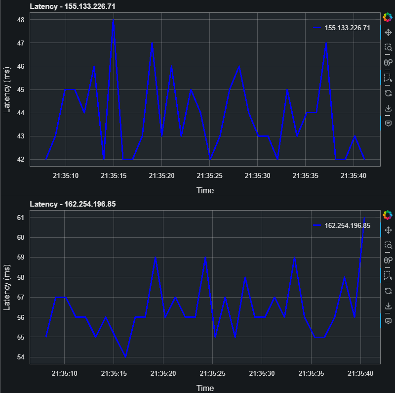

# Bokeh-Latency-Monitoring

This repository contains a Python script for monitoring network latency using `pythonping` and visualizing it with Bokeh. The script extracts target IP addresses from a configuration file, pings them to measure latency and packet loss, and updates interactive plots to visualize this data.

## Features

- **Extract Target IPs**: Parses a configuration file to extract IP addresses to monitor.
- **Ping Targets**: Sends pings to the target IP addresses to measure latency and packet loss.
- **Dynamic Visualization**: Uses Bokeh to create and update plots in real-time.
- **Alerts for Latency Spikes**: Highlights latency spikes by changing the line color in the plot.
- **Interactive Plotting**: Offers interactive features like zooming, panning, and saving plots.

## Requirements

- Python 3.x
- `bokeh` (for interactive plotting)
- `pythonping` (for sending pings)
- `pandas` (for handling timestamps and data)
- `re` (for regular expressions)

You can install the necessary Python packages using pip:

```sh
pip install bokeh pythonping pandas
```

## Configuration
**Configuration File:** Create a file named server_ips_config.txt (or modify the script to use a different file). This file should contain lines formatted like:

```sh
menu = CS2-SERVER
title = CS2-SERVER
host = 155.133.226.71

menu = CS2-SERVER-2
title = CS2-SERVER-2
host = 162.254.196.85
```

## Script Overview
# Functions
1. extract_targets_from_config(file_path):
Extracts IP addresses from the specified configuration file.

2. create_host_plot(host):
Creates a Bokeh plot for a given host.

3. ping_target(target):
Sends pings to the target IP and returns average latency and packet loss.

4. update(host, plot, source):
Updates the plot with the latest latency data and highlights spikes.

# Execution
The script initializes plots for each target IP, updates them every second, and displays the plots in a Bokeh server environment. Latency data is updated in real-time, with a visual indication of latency spikes.

# Running the Script
1. Save the script to a file, e.g., Bokeh-Latency-Monitor.py.
2. Ensure your configuration file (smokeping_config.txt) is correctly set up.
3. Run the Bokeh server with the script:

```sh
bokeh serve --show Bokeh-Latency-Monitor.py
```
This command will start a Bokeh server and open your default web browser to display the interactive plots.

# Webserver Example


# License
This project is licensed under the MIT License. See the LICENSE file for details.